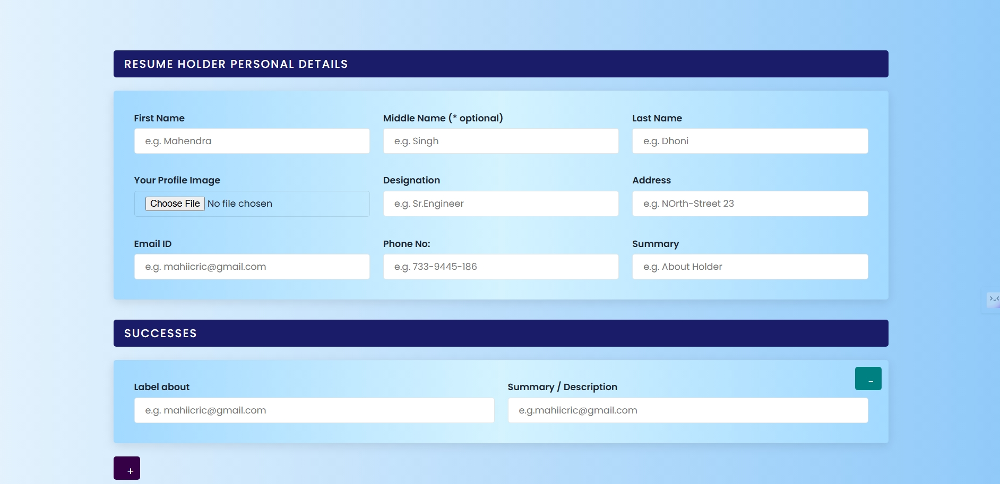
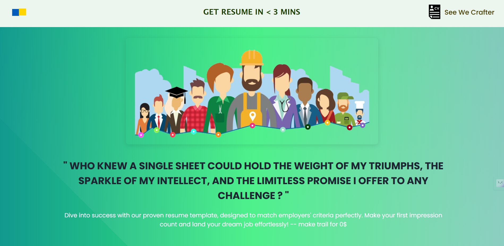
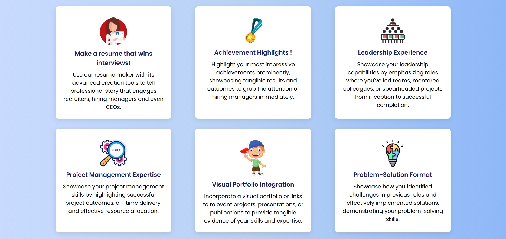

# Resume Builder

## 📌 Overview

A web-based resume builder that allows users to create structured CV data through an interactive form interface.

This project focuses on UI design, form handling, and dynamic data input using JavaScript.

---

## ⚡ Features

- Dynamic form-based resume creation  
- Multiple sections (personal details, achievements, experience)  
- Structured data input and organization  
- Clean and responsive UI  
- SCSS-based styling  

---

## 🛠️ Tech Stack

- HTML  
- CSS / SCSS  
- JavaScript  

---

## 📸 Preview

### 📝 Resume Form

### 🎨 UI Overview

---

## 🌐 Live Demo

> **[https://carriercatalysttool.netlify.app](https://carriercatalysttool.netlify.app)**
